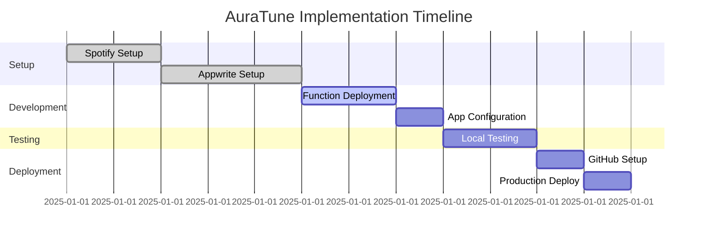

# 🚀 AuraTune Implementation Guide

<div align="center">


**Complete Step-by-Step Guide to Make AuraTune Operational**

[](https://github.com/shivamyadav/auratune)
[](https://github.com/shivamyadav/auratune)
[](https://github.com/shivamyadav/auratune)

</div>

---

## 📋 Pre-Implementation Checklist

Before starting, ensure you have:

- [ ] **Flutter SDK** (3.19.0 or higher) installed
- [ ] **Node.js** (for Appwrite CLI) installed
- [ ] **Git** for version control
- [ ] **Code Editor** (VS Code recommended)
- [ ] **Web Browser** (Chrome recommended)
- [ ] **Internet Connection** for API calls

### 🔑 Required Accounts

- [ ] **Spotify Developer Account** - [Create Here](https://developer.spotify.com/dashboard)
- [ ] **Appwrite Cloud Account** - [Create Here](https://cloud.appwrite.io)
- [ ] **GitHub Account** - [Create Here](https://github.com)

---

## 🎯 Implementation Phases



---

## Phase 1: Spotify Developer Setup 🎵

### Step 1.1: Create Spotify Application

1. **Navigate to Spotify Developer Dashboard**
   - Go to [https://developer.spotify.com/dashboard](https://developer.spotify.com/dashboard)
   - Log in with your Spotify account

2. **Create New App**
   ```
   App Name: AuraTune
   App Description: Musical aura analysis application
   Website: https://auratune.shivamyadav.com.np
   Redirect URI: (Leave empty for now)
   ```

3. **Save App Credentials**
   ```bash
   # Note down these values - you'll need them later
   Client ID: [Your Client ID]
   Client Secret: [Your Client Secret]
   ```

### Step 1.2: Configure App Settings

1. **Edit App Settings**
   - Click on your app in the dashboard
   - Go to "Settings" tab

2. **Add Redirect URIs**
   ```
   # Add these redirect URIs:
   http://localhost:3000
   https://auratune.shivamyadav.com.np
   https://cloud.appwrite.io/v1/account/sessions/oauth2/callback/spotify
   ```

3. **Save Changes**
   - Click "Save" to apply changes

---

## Phase 2: Appwrite Backend Setup ☁️

### Step 2.1: Create Appwrite Project

1. **Navigate to Appwrite Console**
   - Go to [https://cloud.appwrite.io](https://cloud.appwrite.io)
   - Log in or create account

2. **Create New Project**
   ```
   Project Name: AuraTune
   Project ID: [Auto-generated or custom]
   ```

3. **Note Project ID**
   ```bash
   # Save this for later use
   Project ID: [Your Project ID]
   ```

### Step 2.2: Database Configuration

#### Create Database
1. **Navigate to Database Section**
   - Click "Databases" in the left sidebar
   - Click "Create Database"

2. **Database Settings**
   ```
   Database Name: AuraTuneDB
   Database ID: [Auto-generated]
   ```

3. **Create Collection**
   - Click "Create Collection"
   - Collection Name: `profiles`
   - Collection ID: `[Auto-generated]`

#### Configure Collection Attributes

| Attribute Name | Type | Size | Required | Array | Default |
|----------------|------|------|----------|-------|---------|
| `spotifyId` | String | 255 | ✅ | ❌ | - |
| `displayName` | String | 255 | ✅ | ❌ | - |
| `auraVector` | Float | - | ✅ | ✅ | - |
| `auraPersonality` | String | 255 | ❌ | ❌ | "Balanced Listener" |

#### Set Collection Permissions
```yaml
Users Role:
  Create: ✅
  Read: ✅
  Update: ✅
  Delete: ✅
```

### Step 2.3: Authentication Configuration

1. **Enable Spotify OAuth Provider**
   - Go to "Auth" → "Settings"
   - Find "Spotify" provider
   - Click "Enable"

2. **Configure Spotify Provider**
   ```
   Client ID: [Your Spotify Client ID from Step 1.1]
   Client Secret: [Your Spotify Client Secret from Step 1.1]
   ```

3. **Copy Generated Redirect URI**
   ```bash
   # This will be generated automatically
   Appwrite Redirect URI: https://cloud.appwrite.io/v1/account/sessions/oauth2/callback/spotify
   ```

4. **Update Spotify App Settings**
   - Go back to Spotify Developer Dashboard
   - Edit your app settings
   - Add the Appwrite redirect URI from step 3

### Step 2.4: Platform Configuration

1. **Add Flutter Web Platform**
   - Go to "Home" → "Add Platform"
   - Select "Flutter App"
   - Choose "Web"
   - Hostname: `auratune.shivamyadav.com.np`

2. **Create API Key**
   - Go to "API Keys"
   - Click "Create API Key"
   - Name: `AuraTune API Key`
   - Scopes:
     - ✅ `users.read`
     - ✅ `databases.read`
     - ✅ `databases.write`
     - ✅ `documents.read`
     - ✅ `documents.write`
     - ✅ `functions.execute`

3. **Save API Key Secret**
   ```bash
   # Important: Save this securely - it won't be shown again
   API Key Secret: [Your API Key Secret]
   ```

---

## Phase 3: Serverless Function Deployment 🐍

### Step 3.1: Install Appwrite CLI

```bash
# Install Appwrite CLI globally
npm install -g appwrite-cli

# Verify installation
appwrite --version
```

### Step 3.2: Login to Appwrite CLI

```bash
# Login to Appwrite CLI
appwrite login

# Select your project
# Choose: AuraTune
```

### Step 3.3: Deploy Function

```bash
# Navigate to project directory
cd /path/to/auratune

# Deploy the function
appwrite deploy function --functionId analyze-aura

# Wait for deployment to complete
# This may take a few minutes
```

### Step 3.4: Configure Function Settings

1. **Set Execute Permissions**
   - Go to Appwrite Console → Functions → analyze-aura
   - Click "Settings" tab
   - Under "Execute Access", add "Users" role

2. **Configure Environment Variables**
   - Click "Variables" tab
   - Add the following variables:

| Variable Name | Value |
|---------------|-------|
| `APPWRITE_ENDPOINT` | `https://cloud.appwrite.io/v1` |
| `APPWRITE_PROJECT_ID` | `[Your Project ID from Step 2.1]` |
| `APPWRITE_API_KEY` | `[Your API Key Secret from Step 2.4]` |
| `APPWRITE_DATABASE_ID` | `[Your Database ID from Step 2.2]` |
| `APPWRITE_COLLECTION_ID` | `[Your Collection ID from Step 2.2]` |

---

## Phase 4: Application Configuration 🔧

### Step 4.1: Update Configuration File

```bash
# Copy template to actual config
cp lib/config.dart.template lib/config.dart
```

### Step 4.2: Edit Configuration

Open `lib/config.dart` and update with your values:

```dart
class AppwriteConfig {
  // Appwrite Cloud endpoint (usually doesn't change)
  static const String endpoint = 'https://cloud.appwrite.io/v1';
  
  // Your Appwrite Project ID (from Step 2.1)
  static const String projectId = 'YOUR_PROJECT_ID_HERE';
  
  // Your Appwrite Function ID for the analyze-aura function
  static const String analyzeFunctionId = 'analyze-aura';
  
  // Your Appwrite Database ID (from Step 2.2)
  static const String databaseId = 'YOUR_DATABASE_ID_HERE';
  
  // Your Appwrite Collection ID (from Step 2.2)
  static const String collectionId = 'YOUR_COLLECTION_ID_HERE';
  
  // Redirect URLs for OAuth (already configured for your domain)
  static const String successUrl = 'https://auratune.shivamyadav.com.np';
  static const String failureUrl = 'https://auratune.shivamyadav.com.np';
}
```

### Step 4.3: Install Dependencies

```bash
# Install Flutter dependencies
flutter pub get

# Verify installation
flutter doctor
```

---

## Phase 5: Local Testing 🧪

### Step 5.1: Run Application Locally

```bash
# Start the application
flutter run -d chrome

# The app should open in your default browser
# URL: http://localhost:3000
```

### Step 5.2: Test Complete Flow

1. **Test Login Flow**
   - Click "Login with Spotify"
   - Complete OAuth authentication
   - Verify successful login

2. **Test Aura Analysis**
   - Wait for automatic aura analysis to complete
   - Verify radar chart displays
   - Check personality classification

3. **Test Data Persistence**
   - Go to Appwrite Console → Database
   - Verify user data is saved
   - Check aura vector and personality

### Step 5.3: Debug Common Issues

#### Issue: Spotify Login Fails
```bash
# Check redirect URIs in Spotify app settings
# Ensure Appwrite redirect URI is added
# Verify Client ID and Secret are correct
```

#### Issue: Function Execution Fails
```bash
# Check function environment variables
# Verify API key has correct permissions
# Check function logs in Appwrite Console
```

#### Issue: Database Errors
```bash
# Verify collection attributes are correct
# Check collection permissions
# Ensure database and collection IDs are correct
```

---

## Phase 6: GitHub Repository Setup 📚

### Step 6.1: Initialize Git Repository

```bash
# Initialize git repository
git init

# Add all files
git add .

# Create initial commit
git commit -m "Initial commit: AuraTune implementation complete"
```

### Step 6.2: Create GitHub Repository

1. **Go to GitHub**
   - Navigate to [https://github.com](https://github.com)
   - Click "New Repository"

2. **Repository Settings**
   ```
   Repository Name: auratune
   Description: Musical aura analysis app
   Visibility: Public (or Private)
   Initialize with README: ❌ (we already have one)
   ```

3. **Add Remote Origin**
   ```bash
   # Add remote origin (replace with your GitHub username)
   git remote add origin https://github.com/YOUR_USERNAME/auratune.git
   
   # Push to GitHub
   git push -u origin main
   ```

---

## Phase 7: Production Deployment 🚀

### Step 7.1: Enable GitHub Pages

1. **Go to Repository Settings**
   - Navigate to your GitHub repository
   - Click "Settings" tab

2. **Configure GitHub Pages**
   - Scroll to "Pages" section
   - Source: "GitHub Actions"
   - This enables automatic deployment

### Step 7.2: Configure Custom Domain

1. **Add Custom Domain**
   - In Pages settings, add custom domain: `auratune.shivamyadav.com.np`
   - Enable "Enforce HTTPS"

2. **DNS Configuration**
   - Add CNAME record in your DNS settings:
   ```
   Type: CNAME
   Name: auratune
   Value: YOUR_USERNAME.github.io
   TTL: 3600
   ```

### Step 7.3: Trigger Deployment

```bash
# Push any changes to trigger deployment
git add .
git commit -m "Deploy to production"
git push origin main

# GitHub Actions will automatically:
# 1. Build Flutter web app
# 2. Deploy to GitHub Pages
# 3. Configure custom domain
# 4. Set up SSL certificate
```

### Step 7.4: Verify Deployment

1. **Check Deployment Status**
   - Go to repository "Actions" tab
   - Verify deployment completed successfully

2. **Test Live Application**
   - Visit: https://auratune.shivamyadav.com.np
   - Test complete user flow
   - Verify all features work correctly

---

## 🔧 Configuration Summary

### 📋 Final Configuration Checklist

- [ ] **Spotify App**: Created and configured with correct redirect URIs
- [ ] **Appwrite Project**: Created with database, collection, and authentication
- [ ] **Function Deployed**: analyze-aura function deployed and configured
- [ ] **Environment Variables**: All required variables set in function
- [ ] **App Configuration**: lib/config.dart updated with correct IDs
- [ ] **Local Testing**: Application tested locally and working
- [ ] **GitHub Repository**: Code pushed to GitHub repository
- [ ] **GitHub Pages**: Enabled with custom domain
- [ ] **DNS Configuration**: CNAME record added for custom domain
- [ ] **Production Testing**: Live application tested and working

### 🔑 Important Credentials to Save

```bash
# Spotify Developer
Client ID: [Your Spotify Client ID]
Client Secret: [Your Spotify Client Secret]

# Appwrite Cloud
Project ID: [Your Project ID]
Database ID: [Your Database ID]
Collection ID: [Your Collection ID]
API Key Secret: [Your API Key Secret]

# GitHub
Repository URL: https://github.com/YOUR_USERNAME/auratune
Live URL: https://auratune.shivamyadav.com.np
```

---

## 🚨 Troubleshooting Guide

### Common Issues and Solutions

#### 1. Spotify OAuth Errors

**Problem**: Login fails with redirect URI mismatch
```
Error: redirect_uri_mismatch
```

**Solution**:
1. Check Spotify app settings
2. Ensure all redirect URIs are added:
   - `http://localhost:3000`
   - `https://auratune.shivamyadav.com.np`
   - `https://cloud.appwrite.io/v1/account/sessions/oauth2/callback/spotify`

#### 2. Function Execution Errors

**Problem**: Function fails to execute
```
Error: Function execution failed
```

**Solution**:
1. Check function environment variables
2. Verify API key permissions
3. Check function logs in Appwrite Console
4. Ensure function is deployed successfully

#### 3. Database Permission Errors

**Problem**: Cannot save user data
```
Error: Insufficient permissions
```

**Solution**:
1. Check collection permissions
2. Ensure Users role has Create/Read/Update permissions
3. Verify database and collection IDs are correct

#### 4. Build Errors

**Problem**: Flutter build fails
```
Error: Build failed
```

**Solution**:
1. Run `flutter clean`
2. Run `flutter pub get`
3. Check for dependency conflicts
4. Verify Flutter version compatibility

#### 5. Deployment Errors

**Problem**: GitHub Actions deployment fails
```
Error: Deployment failed
```

**Solution**:
1. Check GitHub Actions logs
2. Verify CNAME file exists
3. Check custom domain configuration
4. Ensure repository has correct permissions

---

## 📞 Support and Help

### 🆘 Getting Additional Help

- **📖 Documentation**: Check the main README.md
- **🐛 Bug Reports**: [GitHub Issues](https://github.com/your-username/auratune/issues)
- **💡 Feature Requests**: [GitHub Discussions](https://github.com/your-username/auratune/discussions)
- **💬 Community**: Join our Discord server

### 🔍 Debugging Tips

1. **Enable Debug Mode**
   ```bash
   # Run Flutter in debug mode
   flutter run -d chrome --debug
   ```

2. **Check Console Logs**
   - Open browser developer tools
   - Check Console tab for errors
   - Check Network tab for failed requests

3. **Appwrite Console Logs**
   - Go to Appwrite Console
   - Check Functions → Logs
   - Check Database → Documents

4. **Flutter Inspector**
   - Use Flutter Inspector in VS Code
   - Check widget tree and state

---

## 🎉 Congratulations!

You have successfully implemented AuraTune! Your musical aura analysis application is now:

- ✅ **Fully Functional**: All features working correctly
- ✅ **Securely Deployed**: HTTPS with custom domain
- ✅ **Production Ready**: Optimized for real users
- ✅ **Scalable**: Built for growth and expansion

### 🌟 Next Steps

1. **Monitor Performance**: Use analytics to track user engagement
2. **Gather Feedback**: Collect user feedback for improvements
3. **Iterate and Improve**: Continuously enhance the application
4. **Scale Infrastructure**: Add more features as needed

### 🚀 Launch Your App!

Your AuraTune application is now live at:
**https://auratune.shivamyadav.com.np**

Share it with the world and let users discover their musical DNA! 🎵✨

---

<div align="center">

**🎵 Made with ❤️ by [Shivam Yadav](https://github.com/shivamyadav)**

[](https://github.com/shivamyadav)
[](https://linkedin.com/in/shivamyadav)

**⭐ Star this repository if this guide helped you!**

</div>
